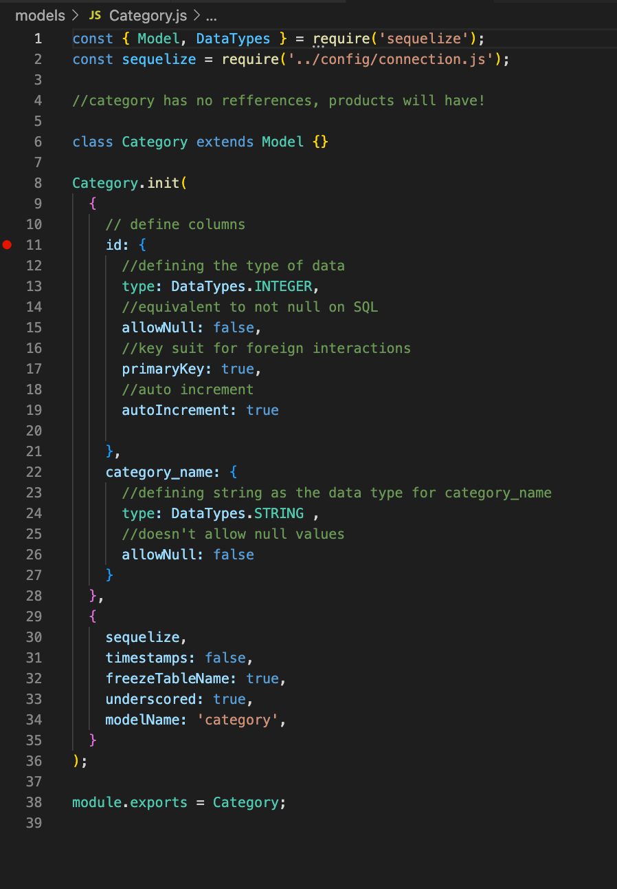

# E-commerce Back End

- [instalation](#instalation)
- [usage](#usage)
- [contribution](#contribution)
- [tests](#tests)

  ## description 
  E-commerce Back End allows you to create, update and delete relational data amongst 'categories', 'products', and 'tags' (for the produtc); and by doing so setting up a e-commerce web application environment.
  
  ## instalation
  * Clone git repository in your machine 
  * install NPM dependencies 
    - MySQL2 
    - Sequelize 
    - Express 
  * Node . or npm start

  ## usage
  This application is used for correlational database development.

  ## license
  MIT

  ## contribution
  Paulo Oliveira

  ## tests
  Individual functionality tests

## Links and preview: 
![Walk-through_video] (https://drive.google.com/file/d/1ggXdOx1FkGdLFLGff5bLJJl64bzgnaCO/view?usp=sharing)

![GitHub-repository] (https://github.com/paulooliveira152012/e-commerce)

Application Screenshot

API Route preview

Connection preview

Model preview

Server preview

Insomnia preview
